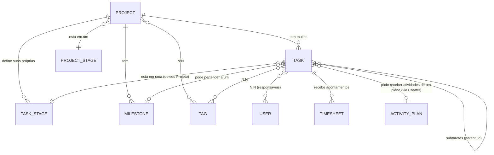

# Análise do plugin `webkul/projects` — estrutura, funcionalidade e sugestão de nome

Investigação feita direto no código **realmente instalado** neste
projeto (`plugins/webkul/projects/`), não numa cópia de referência.
Objetivo: entender o que cada item de menu faz de verdade, confirmar
se existe uma visualização Kanban (quadro com colunas arrastáveis), e
sugerir um nome em português que não colida com o conceito de negócio
"Projeto" que está sendo desenhado em `perseu/comercial` (Obra →
Proposta → Projeto de execução).

**Nenhum código foi alterado nesta tarefa.** Existe um estudo anterior
mais amplo, `ESTUDO-PLUGIN-PROJECTS.md` (focado em "vale a pena
integrar/reaproveitar isso, ou construir um plugin próprio do zero?"),
que já tinha confirmado boa parte do que está aqui (a ausência de
Kanban visual, a dualidade `TaskState`/`stage_id`). Este documento é
mais focado — cobre também o que aquele não detalhou (Planos de
Atividade, o cluster de Configurações completo) e responde
diretamente às perguntas desta tarefa: o que cada item faz, tem
Kanban, e qual nome sugerir.

## 1. Mapa de estrutura

| Model | Tabela | O que representa |
|---|---|---|
| `Project` | `projects_projects` | O projeto em si — o "container" que agrupa Tarefas |
| `ProjectStage` | `projects_project_stages` | Estágio de um **Projeto** (ex.: "Planejamento", "Em andamento", "Concluído") — lista global, compartilhada por todos os projetos |
| `Task` | `projects_tasks` | Uma tarefa dentro de um Projeto; pode ter subtarefas (auto-relacionamento via `parent_id`) |
| `TaskStage` | `projects_task_stages` | Estágio/"coluna" de uma **Tarefa** — configurável **por Projeto** (cada projeto tem seu próprio conjunto) |
| `Milestone` | `projects_milestones` | Um marco/entrega dentro de um Projeto (data + concluído ou não) |
| `Tag` | `projects_tags` | Etiqueta livre e colorida, reaproveitável em Projetos e Tarefas |
| `ActivityPlan` + `ActivityPlanTemplate` (plugin `webkul/support`) | `activity_plans` + `activity_plan_templates` | Um "roteiro" reutilizável de atividades de acompanhamento a agendar automaticamente — ver seção 2.7 |
| `Timesheet` (estende `Webkul\Analytic\Models\Record`) | `analytic_records` | Apontamento de horas trabalhadas numa Tarefa |

Tabelas de relação (pivot): `projects_project_tag`, `projects_task_tag`
(N:N com Tag), `projects_task_users` (uma Tarefa pode ter **vários**
responsáveis ao mesmo tempo), `projects_user_project_favorites`
(projeto favoritado por usuário).

### Relacionamentos principais



**Ponto importante**: "Etapas do Projeto" e "Etapas da Tarefa" são
duas listas **completamente separadas e independentes**:
- **Etapas do Projeto** (`ProjectStage`) classificam o **Projeto
  inteiro** — uma lista única, compartilhada por todos os projetos do
  sistema (ex.: todo projeto passa por "Planejamento → Em andamento →
  Concluído").
- **Etapas da Tarefa** (`TaskStage`) classificam **Tarefas dentro de
  um Projeto específico** — cada Projeto tem seu próprio conjunto
  (a tabela tem uma coluna `project_id`). O Projeto "Reforma Cozinha"
  pode ter as etapas "A Fazer / Fazendo / Revisão / Pronto", enquanto
  o Projeto "Instalação Elétrica" pode ter um conjunto totalmente
  diferente.

## 2. O que cada item de menu faz, na prática

### 2.1 Projetos (`Project`)

**O que é**: o cadastro raiz — um projeto de trabalho, com nome,
descrição, datas de início/fim, horas alocadas, um responsável
("gerente", campo `user_id`), um cliente opcional (`partner_id`),
cor, visibilidade, e três "interruptores" de recurso
(`allow_timesheets`, `allow_milestones`, `allow_task_dependencies`)
que ligam/desligam funcionalidades por projeto.

**Para que serve**: é o container que organiza um conjunto de
Tarefas relacionadas a um mesmo objetivo/entrega. Sem um Project, uma
Task não existe (`project_id` é a FK obrigatória em termos de fluxo).

**Como se relaciona**: tem muitas Tarefas, define seu próprio conjunto
de Etapas de Tarefa, pode ter Marcos, pode ter Tags, e está sempre em
uma (e só uma) Etapa de Projeto.

### 2.2 Tarefas (`Task`)

**O que é**: o item de trabalho de fato — título, descrição rica,
prazo (`deadline`), horas planejadas vs. gastas (calculadas
automaticamente a partir dos Timesheets), um ou mais responsáveis, e
**dois campos de status independentes** (ver 2.4).

**Para que serve**: é a unidade de trabalho que alguém efetivamente
executa. Pode ter subtarefas (uma Task com `parent_id` preenchido) —
as horas de uma subtarefa somam automaticamente na tarefa-pai.

**Como se relaciona**: pertence a um Projeto, está em uma Etapa de
Tarefa (do conjunto do seu Projeto), pode pertencer a um Marco,
recebe Tags, e acumula Timesheets.

### 2.3 Etapas do Projeto / Etapas da Tarefa (`ProjectStage` / `TaskStage`)

Já explicado na seção 1 — são cadastros de apoio simples (só um nome +
ordem de exibição + se aparece "recolhida" por padrão), usados para
classificar Projetos e Tarefas respectivamente. Servem de base para o
agrupamento visual da listagem (ver seção 3) — mas **não são "colunas
de um quadro arrastável"**, apesar do desenho de dados sugerir isso.

### 2.4 O "status" da Tarefa é, na verdade, DOIS campos independentes

Vale destacar porque confunde bastante ao explorar a tela:
- **`stage_id`** (Etapa da Tarefa, seção 2.3) — configurável, livre,
  por Projeto.
- **`state`** (enum PHP fixo, 5 valores): **Em Andamento**, **Mudança
  Solicitada**, **Aprovada**, **Cancelada**, **Concluída** — igual em
  todo o sistema, não depende do Projeto, aparece como um seletor de
  botões (`ToggleButtons`) no formulário da Tarefa.

Uma Tarefa pode estar, por exemplo, na Etapa "Em Revisão" (do
Projeto) E com o Estado "Mudança Solicitada" ao mesmo tempo — são
informações diferentes, respondidas por perguntas diferentes ("em que
fase do fluxo ela está" vs. "qual é a situação/aprovação dela").

### 2.5 Marcos (`Milestone`)

**O que é**: um evento/entrega pontual dentro de um Projeto — nome +
data prevista (`deadline`) + se já foi concluído (`is_completed`) +
quando foi concluído (`completed_at`).

**Para que serve**: sinalizar datas importantes que não são
"tarefas" em si (ex.: "Entrega da Fase 1", "Aprovação do Cliente") —
um jeito de acompanhar prazos-chave de um projeto sem misturar com a
lista de tarefas do dia a dia.

**Como se relaciona**: pertence a um Projeto; uma Tarefa PODE
(opcionalmente) apontar para um Marco (`milestone_id`), associando-a
a essa entrega.

### 2.6 Tags

**O que é**: uma etiqueta livre e colorida (nome + cor), sem nenhuma
outra configuração.

**Para que serve**: marcação/categorização informal — tanto Projetos
quanto Tarefas podem ter várias Tags ao mesmo tempo (relação N:N),
útil para filtrar ou visualmente destacar (ex.: "Urgente", "Cliente
VIP", "Retrabalho").

### 2.7 Planos de Atividade (`ActivityPlan` + Modelos de Atividade)

Este é o item mais fácil de mal-entender — não tem relação direta com
o fluxo Projeto→Tarefa→Etapa. É, na prática, um **checklist reutilizável
de lembretes/follow-ups a criar automaticamente**.

**O que é**: um Plano de Atividade é só um nome (ex.: "Onboarding de
Cliente Novo", "Checklist de Fechamento de Obra") que agrupa vários
**Modelos de Atividade**. Cada Modelo de Atividade define:
- que tipo de atividade criar (ligação, reunião, e-mail, tarefa
  genérica — vem do cadastro `ActivityType`, compartilhado com outros
  módulos do ERP);
- um resumo/nota padrão;
- quem fica responsável (uma pessoa fixa, ou "sob demanda" — decidido
  na hora de aplicar o plano);
- **quando** essa atividade deve vencer: um número de dias
  (`delay_count`) + unidade (dias/semanas/meses) + referência (antes
  ou depois da "data do plano").

**Para que serve**: em vez de criar manualmente 5 lembretes toda vez
que um tipo de situação se repete, o usuário aplica o Plano de
Atividade de uma vez (botão dentro do painel de "Chatter"/atividades
de um Projeto ou Tarefa) e o sistema gera automaticamente todas as
atividades agendadas do plano, já com prazo e responsável calculados.

**Como se relaciona**: não tem FK direta com Project/Task — é
aplicado "por cima" de qualquer Projeto ou Tarefa através do botão de
atividades (`ChatterAction`), que lista os Planos cadastrados
especificamente para o plugin de Projetos (`ActivityPlan::projects()`).

### 2.8 Timesheets (não é um item de menu próprio)

Não aparece como item de menu isolado — é uma aba dentro da tela de
uma Tarefa (`ManageTimesheets`). Cada lançamento é data + usuário +
descrição + horas. Ao salvar, apaga ou edita um lançamento, as horas
"gastas/restantes/progresso" da Tarefa (e da tarefa-pai, se for
subtarefa) são recalculadas automaticamente. Só aparece se o
Projeto tiver `allow_timesheets` ligado.

### 2.9 Configurações (toggles gerais, cluster "Configurações" dentro do próprio plugin)

Duas telas de liga/desliga (não cadastros): **"Habilitar Etapas de
Projeto"**/**"Habilitar Marcos"** (um Toggle cada) e uma tela equivalente
para Timesheets — controlam se essas funcionalidades aparecem no
formulário de Projeto/Tarefa. Não confundir com o cluster de
"Configurações" que lista Etapas/Marcos/Tags/Planos — são dois
clusters Filament diferentes com o mesmo nome de exibição.

## 3. Confirmação sobre Kanban — **NÃO existe quadro com colunas arrastáveis**

Resposta direta: **não**. O que existe hoje é:

1. **Uma listagem em tabela** das Tarefas de um Projeto, com abas de
   filtro pré-definidas (Abertas / Minhas Tarefas / Sem Responsável /
   Fechadas / Favoritas / Arquivadas) e a opção de **agrupar
   visualmente** por Etapa, Estado, Projeto, Marco, etc.
   (`->groups([...])` do Filament) — os grupos aparecem como seções
   colapsáveis **dentro da mesma lista vertical**, não como colunas
   lado a lado.
2. **Arrastar para reordenar** (`->reorderable('sort')`) — funciona
   **dentro da mesma lista/grupo** (mudar a ordem de exibição), não
   entre grupos diferentes. Não existe (nem no Filament nativo) a
   capacidade de arrastar um item de um grupo para outro e isso mudar
   automaticamente sua Etapa.
3. **Um "Progress Stepper"** dentro do formulário de edição da própria
   Tarefa — uma fileira horizontal de botões, um por Etapa do
   Projeto; clicar em um botão muda a Etapa da tarefa que está sendo
   editada. É a forma real de "mudar de etapa" — mas exige abrir a
   tarefa, não é arrastar um cartão numa tela de quadro.

Não há nenhum pacote de Kanban instalado (`composer.json` não lista
nada como `mokhosh/filament-kanban` ou `guava/filament-kanban`) nem
nenhuma view Blade customizada no plugin (só arquivos de tradução).

**Conclusão**: o modelo de dados foi desenhado pensando em Kanban
(etapas ordenáveis, coluna `is_collapsed`), mas a interface entregue
hoje é uma lista de tabela agrupável/reordenável — visualmente mais
parecida com uma planilha organizada por seções do que com um quadro
Trello.

## 4. Fluxo de uso típico

```mermaid
flowchart TD
    A[Usuário cria um Projeto] --> B[Define nome, cliente, datas,\nhoras alocadas, liga/desliga\nMarcos e Timesheets]
    B --> C{Projeto criado}
    C --> D[Cadastra as Etapas da Tarefa\ndeste Projeto\nex: A Fazer / Fazendo / Pronto]
    C --> E[Opcional: cria Marcos\nex: Entrega Fase 1 - 30/09]
    C --> F[Opcional: aplica um\nPlano de Atividade\nex: Checklist de Abertura]
    F --> F2[Sistema gera automaticamente\nas atividades agendadas\ndo plano, com prazo/responsável]
    D --> G[Usuário cria Tarefas\ndentro do Projeto]
    G --> H[Cada Tarefa recebe:\nEtapa da Tarefa, Estado,\nResponsável(is), Tags, prazo]
    H --> I{Time trabalha na Tarefa}
    I --> J[Lança horas via Timesheet]
    J --> K[Sistema recalcula automaticamente\nhoras gastas/restantes/progresso\nda Tarefa - e da tarefa-pai, se houver]
    I --> L[Usuário abre a Tarefa e clica\nno Progress Stepper para\nmudar de Etapa]
    L --> M{Chegou numa Etapa final?}
    M -- não --> I
    M -- sim --> N[Usuário muda o Estado\npara Concluída/Cancelada]
    G --> O[Tarefa pode ser vinculada\na um Marco existente]
    H --> P[Tarefa pode receber Tags\nlivres para categorização]
```

## 5. Onde o rename precisaria acontecer (achado técnico, não implementado)

Só para dar contexto de esforço, caso a decisão de renomear avance: o
rótulo "Projetos" que aparece hoje no dropdown da topbar **não vem do
plugin `webkul/projects`** — vem do arquivo central
`lang/pt_BR/admin.php` (chave `navigation.project`), que é o mesmo
padrão de `NavigationGroup` documentado no CLAUDE.md para os grupos de
navegação do painel inteiro. Ou seja, um rename de EXIBIÇÃO (não das
classes internas `Webkul\Project\*`, que podem continuar com esse
nome técnico sem problema) seria, na prática, trocar essa chave (e as
equivalentes em `en`/`es`/`ar`) — um ajuste pequeno e isolado, não uma
alteração estrutural no plugin. Isso é só um achado de investigação;
nenhuma alteração foi feita.

## 6. Sugestões de nome

Considerando que "Tarefas" já é usado como um item interno (a entidade
`Task`), e que "Kanban" **não deve** ser usado (não existe essa
funcionalidade, seria enganoso), as opções que melhor capturam a
função real do plugin (organizar projetos internos em etapas, com
tarefas, marcos, tags e lembretes automáticos):

1. **"Acompanhamento"** — recomendado. Descreve bem o uso real
   observado (listas agrupáveis, marcos com prazo, planos de
   atividade/lembretes) sem prometer uma funcionalidade que não
   existe (Kanban) nem colidir com "Projeto" do Comercial.
2. **"Gestão de Equipe"** ou **"Organização Interna"** — enfatiza que
   é uma ferramenta de gestão de trabalho interno (mutirões,
   iniciativas, inventário — como já registrado no CLAUDE.md sobre o
   propósito deste plugin no Perseu), distinguindo claramente do
   fluxo comercial Obra→Proposta→Projeto.
3. **"FollowUp"** — mesma ideia de "Acompanhamento", em inglês; já
   tinha sido cogitado pelo usuário e também aparece como sugestão de
   nome de plugin (`perseu/followup`) num estudo anterior
   (`ESTUDO-PLUGIN-PROJECTS.md`, para um plugin novo e mais simples,
   não para este rename) — o que reforça que a ideia "acompanhamento/
   follow-up" já parecia a mais natural em duas investigações
   independentes.

**Não sugerido**: "Kanban" (funcionalidade não existe, seria
enganoso) e "Tarefas" (já ocupado, como o próprio usuário observou).
